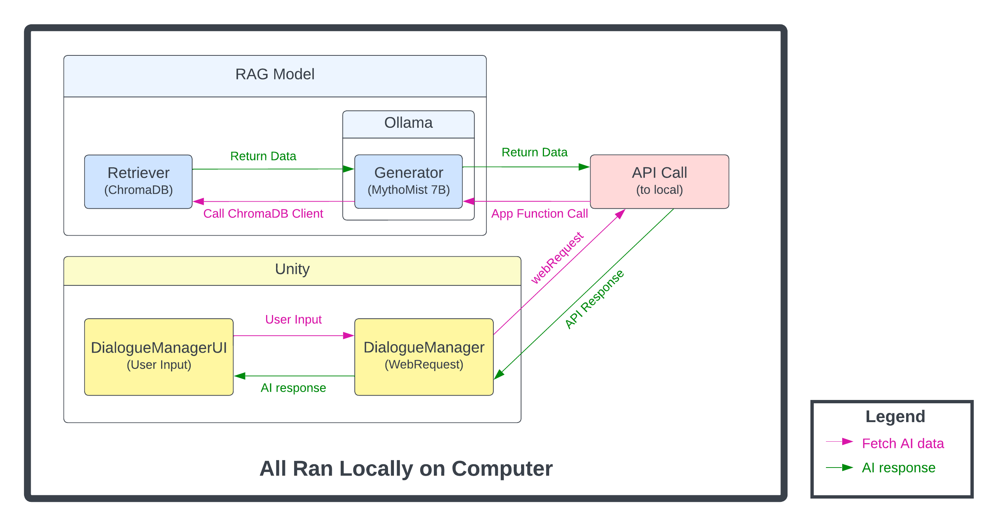

# Boba Stop

**AI-Driven NPC Dialogue Demo · Unity · C# · Python · FastAPI · RAG · Local LLMs**

Boba Stop is a senior capstone project exploring how locally hosted language models and Retrieval-Augmented Generation (RAG) can enable dynamic NPC conversations inside a Unity game.

Rather than being developed as a full game, Boba Stop is a playable technical and gameplay demo centered around AI-driven NPC interaction. Players can communicate with characters through free-form dialogue while the system retrieves relevant contextual information to help generate character-specific responses.

All AI inference is performed locally on the user's computer without requiring a cloud-hosted language model or paid API tokens.

## Demo

A packaged Windows build is available for anyone who wants to try the project without configuring the Unity development environment manually.

**[Download Boba Stop - Windows Build](https://drive.google.com/drive/folders/1rqc610Ga7S38xwZxVAmuWclNAYq4xt9H?usp=sharing)**

The release build includes the game and supporting backend components used to demonstrate the local AI dialogue system.

### Video Demo

*A short demonstration of Boba Stop's NPC dialogue system and local AI integration.*

## AI-Driven NPC Dialogue

Boba Stop explores an alternative to relying entirely on predefined dialogue trees.

Players provide free-form input through the game's dialogue interface. The Unity client communicates with a locally running Python backend, which retrieves relevant information and provides that context to a locally hosted language model before returning the generated response to the game.

The system was designed around:

- Free-form player dialogue
- Character-specific contextual information
- Shared world and common knowledge
- Retrieval-Augmented Generation (RAG)
- Local language model inference
- Unity-to-Python communication
- Dynamic NPC responses

The goal was to combine authored information about characters and the game world with the flexibility of generative dialogue while keeping inference on the user's own computer.

## Architecture

Boba Stop separates the Unity game client from its locally hosted AI infrastructure through a Python backend built with FastAPI.

At a high level:

1. The player enters free-form dialogue through Unity.
2. Unity's `DialogueManager` sends a web request to the local FastAPI backend.
3. The backend retrieves relevant character-specific and common knowledge from ChromaDB.
4. Retrieved information is supplied as context to the locally hosted language model through Ollama.
5. The model generates an NPC response using the retrieved context.
6. The response is returned through the API and displayed in Unity.

The project uses **ChromaDB** for contextual retrieval and **Ollama** for local language-model inference.

**MythoMist 7B** was used during development and experimentation, while the final release build uses **Llama 3.2**.

Character-specific and shared knowledge can be populated from structured CSV data into the retrieval database, keeping authored game information separate from the language model itself.

This architecture allows the Unity client, retrieval database, language model, and API layer to remain separate components while running locally on the same computer.

## Gameplay Systems

Although AI-driven dialogue is the primary focus of Boba Stop, the demo includes supporting gameplay systems used to create an interactive environment around its NPC interactions.

Development included:

- Slot-based inventory and item systems
- Support for more than 20 item types
- NPC interaction and dialogue management
- More than 100 unique dialogue interactions
- Reusable gameplay components supporting interactions between the player, items, and NPCs

## Backend & Deployment

The Python backend was developed as a separate component responsible for retrieval, language-model inference, and communication with Unity.

The backend includes:

- FastAPI-based local communication with the Unity client
- ChromaDB-backed contextual retrieval
- Character-specific and common-knowledge datasets
- CSV-to-ChromaDB data ingestion
- Ollama-based local model inference
- Separate generation and retrieval components
- Windows startup and packaging scripts

The backend was packaged for Windows to reduce the amount of manual environment configuration required when running the demo on another machine.

This deployment work reduced setup on a new development machine to under **5 minutes**.

## Local AI

A major goal of Boba Stop was demonstrating that generative NPC dialogue does not necessarily require a cloud-hosted AI service.

The project's AI components run locally, avoiding reliance on external inference APIs and allowing dialogue generation to use resources available on the user's own computer.

This approach also introduced practical constraints around model size, inference performance, and hardware requirements. Development included experimentation with different local models before **Llama 3.2** was selected for the release build.

The project later influenced the AI architecture being explored for **Project Warden**, where these ideas are being expanded through persistent character context, greater model flexibility, and a stronger focus on completely offline inference across consumer hardware.

## From Boba Stop to Project Warden

Boba Stop served as an early testbed for integrating generative AI directly into gameplay.

Several concepts explored here later influenced Project Warden:

- Separating game and AI infrastructure
- Grounding generated dialogue in authored character information
- Using retrieval to provide contextual knowledge
- Running language models locally
- Packaging AI infrastructure for use alongside a game
- Designing generative AI specifically around interactive characters

Project Warden builds on these experiments with a more modular backend architecture and ongoing work involving persistent character context, interchangeable model backends, dialogue evaluation, and small-model experimentation.

## Team

Boba Stop was developed from **September 2024 to April 2025** as a three-person senior capstone project.

### Christopher Liwanag
**Project Producer · Developer (Gameplay) · Gameplay Designer**

### Angel Cervantes
**Developer (AI, Gameplay, UI/UX) · UI/UX Designer · Art Director**

### Alexis Nemsingh
**Developer (Environment) · Narrative Designer**

## Technologies

**Game Development**
- Unity 2022.3.49f
- C#

**Backend & AI**
- Python
- FastAPI
- Ollama
- Llama 3.2
- MythoMist 7B
- ChromaDB
- Retrieval-Augmented Generation (RAG)

**Development**
- Git
- GitHub

## Project Status

**Completed — April 2025**

Boba Stop is a completed senior capstone prototype and technical demo. Its primary purpose was to explore and demonstrate locally hosted, AI-driven NPC dialogue within an interactive Unity environment.
